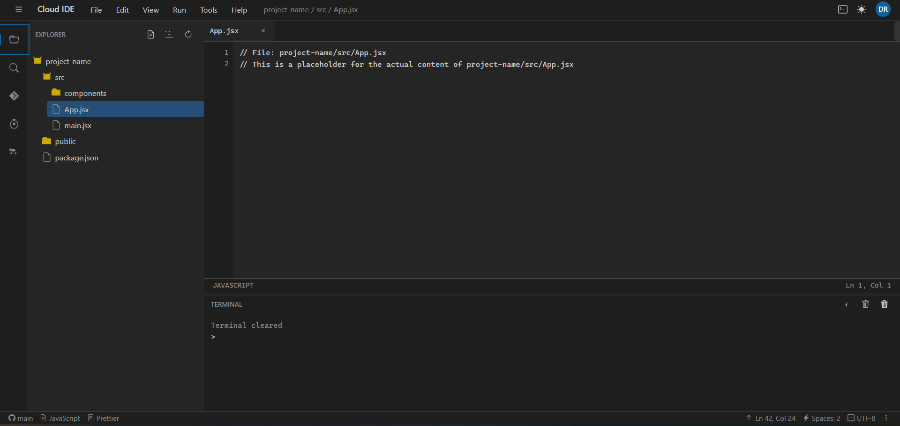

# Cloud IDE

A browser-based integrated development environment that lets you code, build, and deploy from anywhere.

> **Note:** This project is currently under active development. Features and documentation are being continuously improved and updated.



## Project Structure

```
cloud-ide/
├── client/                       # Frontend codebase (React)
├── server/                       # Python backend
├── docker/                       # Docker configurations
└── tests/                        # Test suite
```

## Getting Started

### Prerequisites

- Node.js (v14 or higher)
- Python (v3.8 or higher)
- Docker and Docker Compose
- Git

### Installation

1. Clone the repository
   ```bash
   git clone https://github.com/Simran32909/CloudBasedIDE.git
   cd CloudBasedIDE.git
   ```

2. Set up the frontend
   ```bash
   cd client
   npm install
   ```

3. Set up the backend
   ```bash
   cd ../server
   pip install -r requirements.txt
   ```

4. Start the development environment
   ```bash
   cd ..
   docker-compose -f docker/docker-compose.yml up -d
   ```

5. Start the backend server
   ```bash
   cd server
   python main.py
   ```

6. Start the frontend
   ```bash
   cd ../client
   npm run dev
   ```

7. Open your browser and navigate to `http://localhost:3000`

## Running Tests

### Frontend Tests
```bash
cd client
npm test
```

### Backend Tests
```bash
cd server
pytest
```

## Development

### Current Development Status

This project is still underway and being actively worked on. Some features may be incomplete or subject to change. Contributions and feedback are welcome as we continue to improve the application.

### Backend API

The backend exposes the following API endpoints:

- `/api/auth` - Authentication endpoints
- `/api/files` - File operations
- `/api/execution` - Code execution
- `/api/git` - Git operations

### Frontend Components

The client is organized into the following main components:

- **Editor** - Code editor with syntax highlighting
- **FileExplorer** - File navigation interface
- **Terminal** - Command-line interface
- **UI** - Shared UI components

## Contributing

1. Fork the repository
2. Create your feature branch (`git checkout -b feature/amazing-feature`)
3. Commit your changes (`git commit -m 'Add some amazing feature'`)
4. Push to the branch (`git push origin feature/amazing-feature`)
5. Open a Pull Request

## License

This project is licensed under the MIT License - see the [LICENSE](LICENSE) file for details.
